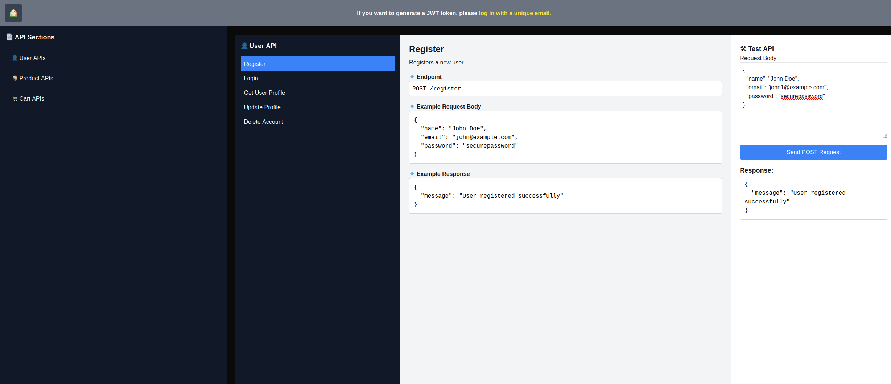

# 🛒 Microservices E-commerce App
A scalable E-commerce platform built with **Golang**, **Next.js**, **PostgreSQL**, and deployed using **Docker**, **Kubernetes**, and **Helm**.
On new release a fresh image of ui and services is pushed to docker hub and chart is updated too.

---

## 🚀 Deployment Options
- **Docker Compose:** `docker-compose up --build`
- **Kubernetes Manifests:** `kubectl apply -f k8s/`
- **Helm Charts:** `helm install ecommerce ./helm`

---

## 🔄 CI/CD Pipeline
- Builds and pushes Docker images to Docker Hub.
- Generates and pushes Helm charts.
- Auto-deploys the latest build.

---

## 🧱 Project Structure
- **services/** – Golang microservices (Cart, Catalog, User)
- **ui/** – Next.js frontend
- **k8s/** – Kubernetes YAML manifests
- **helm/** – Helm charts for Kubernetes deployment

---

## 🔐 Authentication
- **JWT-based authentication** stored in local storage.
- Middleware protects routes requiring authentication.
- OpenAPI schema or Swagger not used as the project utilizes a custom-built lightweight framework optimized for the microservices architecture, ensuring full control over request validation, JWT token management, and streamlined API interactions tailored to specific project needs.
---

## 🔄 API Routes
- **Cart:** Add, remove, clear items (JWT protected)
- **Catalog:** CRUD products (JWT protected for admin)
- **User:** Register, login, manage profiles (JWT protected)

---

## 🛠️ Makefile Commands
- `make docker` – Start with Docker Compose
- `make k8s` – Deploy with Kubernetes
- `make helm` – Deploy using Helm
- `make clean` – Tear down deployments

---

---

## 🔑 Environment Variables
DB_HOST={ db-name }  
DB_PORT=5432  
DB_USER={ db-user }  
DB_PASSWORD={ db-password }  
DB_NAME={ db-name }  
JWT_SECRET={ jwt-secret }  

---

**Secure, scalable, and modern e-commerce solution with JWT-based authentication and flexible deployment options!**

